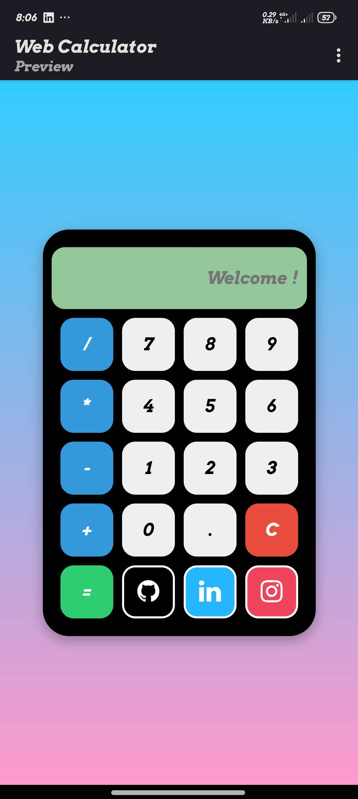

# Web-Calculator-
This project is a web-based calculator that features a simple and modern user interface. The calculator is built using HTML, CSS, and JavaScript, making it easy to customize and extend. The calculator supports basic arithmetic operations, including addition, subtraction, multiplication, and division. 
# Web Calculator
. 
================. 
=====================
# Simple-Calculator

<a href="https://github.com/MohitChattlani/Simple-Calculator/blob/master/LICENSE"></a>
<a href="https://twitter.com/chattlanimohit"></a>

A simple Calculator for general purposes.

## Why use it?

Its useful for simple calculations.

## Features

* Add
* Multiply
* Subtract
* Divide

## Built With

* love
* html
* css
* javascript

## How to Run?

To run my application you simply need to clone the project and run the html file.

## Screenshot


Issues
==========
* Internet Explorer you need to allow all the scripts to run.
* Not working in Mozilla.
* Feel free to submit more issues and enhancement requests.

Contributing
==========
Any kind of contributions are welcome.

1. <a href='https://help.github.com/articles/fork-a-repo/'>**Fork**</a> the repo on GitHub.
2. <a href='https://help.github.com/articles/cloning-a-repository/'>**Clone**</a> the project to your own machine.
3. <a href='https://git-scm.com/book/en/v2/Git-Basics-Recording-Changes-to-the-Repository'>**Commit**</a> changes to <a href='https://git-scm.com/book/en/v2/Git-Branching-Branches-in-a-Nutshell'>**development branch**</a>.
4. <a href='https://help.github.com/articles/pushing-to-a-remote/'>**Push**</a> your work back up to your fork.
5. Submit a <a href='https://help.github.com/articles/about-pull-requests/'>**Pull request**</a> so that i can review your changes

##License

```Groovy
MIT License

Copyright (c) 2016 Mohit chattlani

Permission is hereby granted, free of charge, to any person obtaining a copy
of this software and associated documentation files (the "Software"), to deal
in the Software without restriction, including without limitation the rights
to use, copy, modify, merge, publish, distribute, sublicense, and/or sell
copies of the Software, and to permit persons to whom the Software is
furnished to do so, subject to the following conditions:

The above copyright notice and this permission notice shall be included in all
copies or substantial portions of the Software.

THE SOFTWARE IS PROVIDED "AS IS", WITHOUT WARRANTY OF ANY KIND, EXPRESS OR
IMPLIED, INCLUDING BUT NOT LIMITED TO THE WARRANTIES OF MERCHANTABILITY,
FITNESS FOR A PARTICULAR PURPOSE AND NONINFRINGEMENT. IN NO EVENT SHALL THE
AUTHORS OR COPYRIGHT HOLDERS BE LIABLE FOR ANY CLAIM, DAMAGES OR OTHER
LIABILITY, WHETHER IN AN ACTION OF CONTRACT, TORT OR OTHERWISE, ARISING FROM,
OUT OF OR IN CONNECTION WITH THE SOFTWARE OR THE USE OR OTHER DEALINGS IN THE
SOFTWARE.
